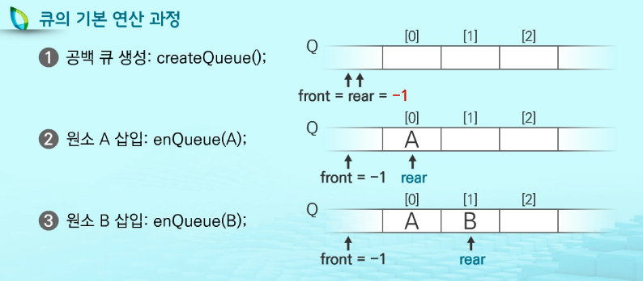
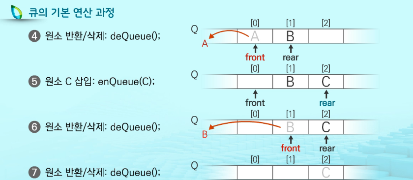

## 09 / 02 Queue

### 큐(Queue)

> 선입선출(First in First Out, FIFO) 구조

#### 1. Queue의 기본 연산

실제로 코딩할 때 아래와 같은 명령어를 사용 ❌, 명칭⭕

- 삽입 : enQueue
- 삭제 : deQueue

#### 2. Queue의 주요 연산

- enQueue() 			: Queue의 뒤쪽(rear 다음)에 원소를 삽입하는 연산
- deQueue()             : 삭제
- createQueue()     : 공백 Queue 생성
- isEmpty()              : 큐가 공백상태인지 확인하는 연산
- isFull()                    : 큐가 포화상태인지 확인하는 연산
- Qpeek()                   : 검색. 가장 마지막에 있는 Queue를 반환시킨다

#### 3. Queue의 기본 연산 과정

#### 4. Queue 종류

- 선형 Queue :/
- 원형 Queue
- 연결 Queue
- 우선순위 Queue

#### 선형 Queue 이용 시 문제점

- 잘못된 포화상태의 인식

✔ 해결방법 1.

✔ 해결방법 2.

1차원 배열을 사용하되 논리적으로는 배열의 처음과 끝이 연결되어 **원형 형태의 Queue**를 이룬다고 가정한  후 사용

### 우선순위 큐(Priority Queue)

- 특성
  - 우선순위를 가진 항목들을 저장하는 큐
  - FIFO 순서가 아니라 우선순위가 높은 순서대로 먼저 나가게 된다.
- 우선순위 큐의 적용 분야
  - 시뮬레이션 시스템
  - 네트워크 트래픽 제어
  - 운영체제의 태스크 스케줄링

### BFS

연결 큐의 구조 Skip

조합적 문제

- 부분집합
- 순열, 중복순열
- 조합, 중복조합