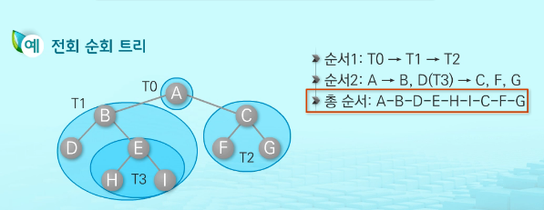
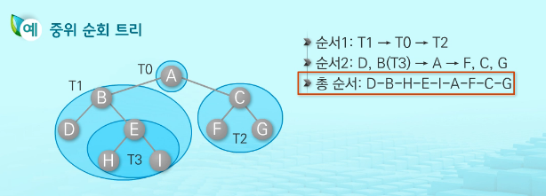
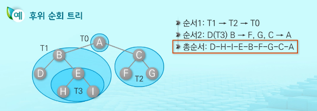

## 09 / 09 트리(Tree)

### Tree

> 한 개 이상의 노드로 이루어진 유한 집합

- 루트(Root) : 노드들 중 최상위 노드
- 나머지 노드들 : n(>=0) 개의 분리 집합 T₁, T₂,…Tn으로 분리할 수 있음.
- 이들 분리집합은 각각 하나의 트리가 되며(재귀적 정의), 루트의 서브 트리(SubTree)라고 함.


### 이진 트리(Binary Tree)

> 모든 노드들이 2개의 서브트리를 갖는 특정 형태의 트리

- 자식 노드를 최대 2개까지만 가질 수 있음

  - Left Child node
  - Right Child node

- 종류

  - 포화 이진 트리

    모든 레벨에 노드가 포화 상태로 차 있는 이진 트리

  - 완전 이진 트리

  - 편향 이진 트리

- 순회(Traversal)

  Tree는 `비선형구조`이므로 순회를 찾는 특별한 방법이 필요함.

  - 전위 순회(Preorder traversal)

  

  - 중위 순회(Inorder traversal)

  

  - 후위 순회(Postorder traversal)

  

  


### 힙 / Heap


> **완전 이진 트리**에 있는 노드 중에서 키 값이 가장 큰 노드와 가장 작은 노드를 찾기 위해서 만든 구조
>
> *완전이진트리 : 인덱스 풀방임

#### 최대 힙

- 키 값이 가장 큰 노드를 찾기 위한 완전 이진 트리
- (부모 노드의 키 값 > 자식 노드의 키 값)
- 루트 노드 : 키 값이 가장 큰 노드

#### 최소 힙

- 키 값이 가장 작은 노드를 찾기 위한 트리


#### 힙 연산

- 삽입
- 삭제
  - 루트 노드의 원소만을 삭제 가능
  - 루트 노드의 원소를 삭제하여 반환한다
  - 힙의 종류에 따라 최대/최소값을 구할 수 있다


#### Heap Code

```python


def heap_push(item):
    global heap_count
    heap_count += 1
    heap[heap_count] = item

    cur = heap_count
    parent = cur // 2

    # 루트가 아니고, if 부모노드값 > 자식노드값-> 스왑
    while parent and heap[parent] > heap[cur]:
        heap[parent], heap[cur] = heap[cur], heap[parent]
        cur = parent
        parent = cur // 2


def heap_pop():
    global heap_count
    item = heap[1]
    heap[1] = heap[heap_count]
    heap[heap_count] = 0
    heap_count -= 1

    parent = 1
    child = parent * 2
    if child + 1 <= heap_count:  # 오른쪽 자식 존재
        if heap[child] > heap[child + 1]:
            child = child + 1

    # 자식노드가 존재하고,  if 부모노드 > 자식노드 -> 스왑
    while child <= heap_count and heap[parent] > heap[child]:
        heap[parent], heap[child] = heap[child], heap[parent]
        parent = child
        child = parent * 2
        if child + 1 <= heap_count:  # 오른쪽 자식 존재
            if heap[child] > heap[child + 1]:
                child = child + 1
    # return해서 돌려주려면 위의 item 인덱스 지정해주어야 함.
    return item

# 최소힙
heap_count = 0

temp = [7, 2, 5, 3, 4, 6]
N = len(temp)

heap = [0] * (N + 1)

for i in range(N):
    heap_push(temp[i])
print(heap)
# for i in range(N):
#     print(heap_pop())
```


------

### 보충학습

#### while

> 조건이 **참**인 동안 반복
>
> 조건식 => 결과가 참/거짓을 판별할 수  있음(True/False)

횟수가 지정돼 있는 경우에는 굳이 `while`을 안 써도 됨. 판별 등의 로직이 필요한 경우에 `while`사용 추천

#### 반복문

- `break` :반복문을 빠져나감

- `continue` : 해당 반복문만 실행하지 않고 다음 코드로 넘어감

- `for` : 횟수 정해져 있음

  반복을 하다가 어떤 조건을 더 이상 만족하지 않을 때 반복을 종료

```python
for (초기 조건: 조건문: 반복계수 갱신):
    문장
```

#### Flag 

_인지 아닌지 판별하는 변수


#### 재귀 함수

```python
def func():			# 함수를 정의함
    print('hello')
    func()			# 함수 자신을 호출(실제 출력X)함
func()				# 여기서 실제 출력에 영향 가는 호출

####여기까지의 코드를 실행하면 무한루프####
# How to control infinity loop ?
# : 매개변수를 하나 받아옴 ex)func(k)의 k 같은 기능
# 	재귀 호출이 일어날 때마다 매개변수가 변하도록 설정
#	재귀 함수에서 매개변수의 값을 이용해 조건을 설정하고
#	일정 조건을 만족하지 않으면 더 이상 함수 호출 X == return
```

- 재귀 함수의 구조

  - 기본 파트(Base Part)

    : 적어도 하나의 재귀에 빠지지 않는 경우가 있어야 함.

    : 조건식을 만족하면 리턴하게끔(더 이상 호출하지 않도록)

  - 유도 파트(Recursion Part)

    : 자기 자신을 호출하는 부분

    : 재귀를 반복하다보면 결국 base case에 수렴하도록 해야 함.


