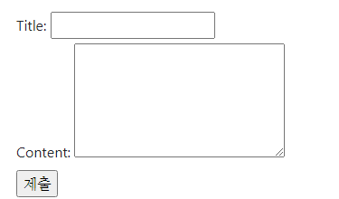
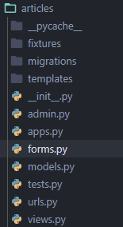
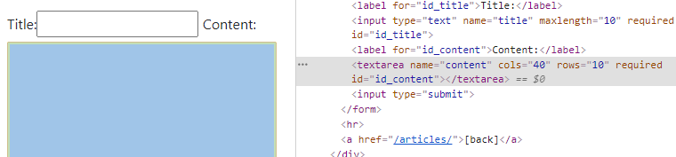

## 09 / 14 Form|Static|Media


### Form



> Form은 django 프로젝트의 주요 유효성 검사 도구들 중 하나이며, 공격 및 우연한 데이터 손상에 대한 중요한 방어수단이 된다.

- django는 Form에 관련된 작업의 아래 세 부분을 처리해 준다.

  - 렌더링을 위한 데이터 준비 및 재구성
  - 데이터에 대한 HTML, form 생성
  - 클라이언트로부터 받은 데이터 수신 및 처리

Form의 작성 방법은 `models.py`와 유사하다.



app 폴더 내에 forms.py 파일을 생성함으로써 시작된당

```python
from django import forms


class ArticleForm(forms.Form)
#forms라는 모듈 안의 Form 클래스를 받아옴
```

instance로 만들어준다는 게 무슨 뜻이지

#### widget

> HTML의 input 태그를 담당함
>
> Form >> widget

- Built-in widgets

#### model form



태그가 `input` -> `textarea`로 바뀐 것 확인 가능