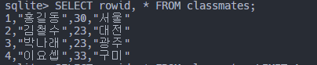
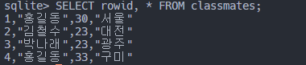

## 10 / 05


#### serializer

- Django에서 제공
- django에서 table처럼 저장돼 있는 데이터를 문자열을 모아놓은 목록처럼 바꿀 수 있는 행위(Serialize)를 하는 것(+-er)
  - 직렬화
  - 


<hr>

### 보충학습 - DB


#### schema

: 데이터베이스에서 자료의 구조, 관계, 표현방법 등을 정의한 구조

- column과 data type으로 구성
- table : 열(column/field)과 행(record/value)으로 구성되어 있음
- pk(primary key, 기본키): 각 행의 고유값으로 반드시 설정이 필요하며, DB 관리 및 관계 설정 시 주요하게 활용됨(고유한 값을 가져야 함 like 주민등록번호)

#### SQL

1) DDL(Data Definition Language, 데이터 정의 언어)

- 데이터를 정의하기 위한 언어
- 관계형 데이터베이스 구조(table, schema)를 정의하기 위한 명령어

2) DML(Data Manipulation Language, 데이터 조작 언어)

- 데이터의 수정, 저장, 삭제, 조회 등을 하기 위한 언어

3) DCL(Data Control Language, 데이터 제어 언어)

#### sqlite3

```python
sqlite3 tutorial.sqlite3
```

`.mode csv` : comma(`,`)로 구분하겠다는 의미 - *comma seperated value*

`.mode table` : table의 형태로 구분하겠다

`.mode headers on` : table의 header를 출력해서 조금 더 보기 좋은 출력

`LIMIT`을 뒤에 붙이면 원하는 데이터의 개수만큼만 갖고 올 수 있다.

```python
SELECT rowid, * FROM classmates;

# 출력 결과
1,"홍길동",30,"서울"
2,"김철수",23,"대전"
3,"박나래",23,"광주"
4,"이요셉",33,"구미"
```

```python
sqlite> SELECT rowid, * FROM classmates LIMIT 1;

# 출력 결과 : 1,"홍길동",30,"서울"
```

`OFFSET`

```python
sqlite> SELECT rowid, * FROM classmates LIMIT 1 OFFSET 2;      
3,"박나래",23,"광주"
```

`DISTINCT` 중복 없이 값을 가져올 수 있다.


`AUTOINCREMENT` : 기존 데이터를 지우고 새로 만들더라도 기존 값의 재사용이 이루어지지 않음(ex.django에서 게시판 만들 때 1, 2, 3번 글을 만들고 지우면 다시 1,2,3이 아니라 4부터 시작하는 방식)

|                            Before                            |                            After                             |
| :----------------------------------------------------------: | :----------------------------------------------------------: |
|  |  |

`sqlite> UPDATE classmates SET name = '홍길동' WHERE rowid = 4; `를 써서 특정 데이터의 id 값을 수정할 수 있다.

