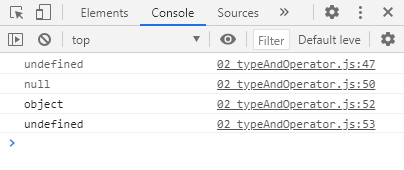

## 10 / 13

> JavaScript 기초 문법

let 재할당 가능 / 재선언 불가

변수 설정할 때에 `const`, `let`,`var` 중 어떤 걸 써야할지 모르겠으면 일단 `const` ㄱㄱ 나중에 에러나면 바꿔도 된당


블록 - 아래 코드에서 하나의 중괄호가 하나의 블록

``` js
if (x === 1) {
  let x = 2
  console.log(x)  // 2
}
```

`// *const message = 홍길동은 ${age}세입니다.`*`

f-string.

> 타입과 연산자

```javascript
let firstName  // 선언만 하고 할당하지 않음
console.log(firstName)  // undefined

let lastName = null
console.log(lastName)  // null - 의도적으로 값이 없음을 표현함

console.log(typeof null)          // "object"
console.log(typeof(undefined))     // "undefined"
```




```javascript
let c = 0

c += 10 
console.log(c) // 10 - c에 10을 더한다

c -= 3 
console.log(c) // 7 - c에 3을 뺀다

c *= 10 
console.log(c) // 70 - c에 10을 곱한다

c++
console.log(c) // 71 - c에 1을 더한다(증감식)

c--
console.log(c) // 70 - c에 1을 뺀다.(증감식)
```


`==` 연산자 안 쓰는 것을 추천!!!!

#### Loop & Condition

```javascript
const name = '홍길동'

switch(name) {
	case 'admin': {
		console.log('관리자님 환영합니다.')
		break
	}
	case 'manager': {
		console.log('매니저님 환영합니다.')
		break
	}
	default: {
		console.log(`${name}님 환영합니다.`)
	}
}

```

break 걸어주는 과정이 필요함.


`const name = 'admin'` break는 주석 처리하고 실행한 결과는 위 그림과 같다(모든 코드가 다 실행됨).


```javascript
// 반복문인데 아래 코드 돌리면 렉 오짐
while
let i = 0

while (i < 6) {
	console.log(i)
	i++
}
```

Javascript의 for문 != Python의 for문


#### Function

함수 쓸 때 선언문 - 맨 위에 쓰는 편이 좋음.

선언문으로 써야만 hoisting이 가능해짐

arrowfunction


#### Data structure

`.join` 함수


#### Array

```javascript
// forEach
const colors = ['red', 'blue', 'green']
// 인자로 주어진 함수를 배열의 요소 각각마다 실행한다.
colors.forEach(function (color) {
    console.log(color)
})
for (let i = 0; i < colors.length, i++){
//   console.log(colors[i])
// }
/*
arrowfunction을 사용해서 줄일 수 있다.
한 줄로 써도 무관함!
colors.forEach(color=>{
  console.log(color)
})
*/
```

`map` : 인자로 주어진 함수의 결과(return)를 배열로 만들어서 return 해 줌.

리턴을 안 함 == undefined를 리턴해줌 같은 뜻


`reduce` 어려움.


