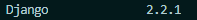
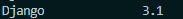
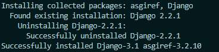

## 08 / 14 | Django

### Django?

>Python web framework / 

web framework : 웹페이지 개발 과정에서 오는 통상적인 어려움을 줄이고자 하는 것

#### 1. MTV pattern

Model + Template + View

#### 2. Django project 생성

①`pip install django` 	django 설치

#️⃣선택사항

`pip list`						  설치된 django 버전 확인

 현재 설치된 버전

업그레이드한 버전

`python -m pip install -U Django` 명령어를 통해 구버전을 uninstall하고 최신 버전으로 설치할 수 있다(<u>django 2.x 버전으로 제작된 프로젝트는 다른 버전으로 작업할 수❌</u>  )



② `django-admin startproject 프로젝트이름`

프로젝트를 만들게 되면 파일 트리에 프로젝트 이름과 같은 폴더가 생성되게 된다.

프로젝트 이름 생성 시에 **<u>`-`,  Python이나 Django에 내장된 기본 이름(ex. random 등)으로는 할 수 없다</u>**.

③ `python manage.py startapp 앱 이름`

django는 앱 단위로 프로젝트를 구성하게 된다.

④ 프로젝트 폴더 내의 `settings.py`에 생성한 앱 등록

```python

INSTALLED_APPS = [
    '앱 이름',
    '그 외에',
    '원래 있던',
    '앱들 목록',
    ...
]
```

⑤ urls.py

urlpatterns 목록에 해당하는 페이지가 있는지 탐색 후 있으면 띄워 주고 없으면 **page not found 404**를 띄워 준다🙄

⑥ views.py

```python
from django.shortcuts import render # 이거 있어야 받아올 수 있음


def anyfunc1(request):		# 첫 번째 인자는 항상 request
    return render(request, '받아오고 싶은.html')


```


⑦ template