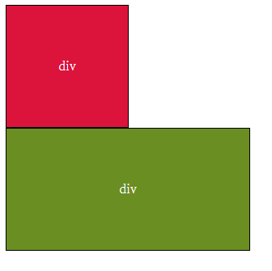
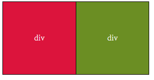
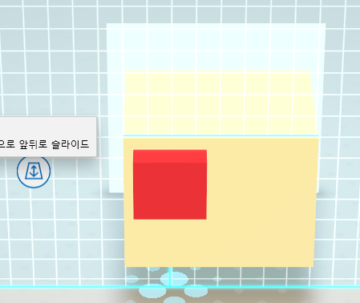
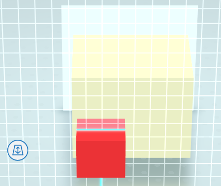

## 08 / 12 TIL | Web 02 - CSS Layout


> CSS layout : 웹 페이지에 포함되는 요소들을 모으고, 해당 요소들이 각각 어느 위치에 놓일 것인지를 제어하는 기술

### 1. Float

> Float된 이미지 좌, 우측 주변으로 텍스트를 둘러싸는 레이아웃을 위해 도입.

#### 1) Float 속성

- None : 기본값

- left : 요소를 왼쪽으로 띄움 ➡ side bar가 왼쪽에 위치한다거나 하는 경우
- right : 요소를 오른쪽으로 띄움

##### Float - a.k.a 집 나간 자식



⬇ 오른쪽 빨간 네모에 `float left` 속성을 주면



?ㅇ? 두 네모의 크기가 같아졌다? ❌

float left 속성으로 인해  빨간 네모가 float 되고 아래 빈 공간을 초록 네모가 채워 들어갔음 ⭕

<u>노란색 - 웹 페이지</u>

<u>빨간색 - float 하고자 하는 타겟 요소</u>

float 하기 전은 아래 그림처럼 웹 페이지와 붙어 있는 구조라면



float한 후는 아래 그림처럼 웹 페이지로부터 떠오르는(글자 그대로 float하는) 구조가 된다. 아래 빈 여백에 초록 네모가 채워짐으로써 초록 네모가 작아지고, 두 네모의 크기가 같아지는 것처럼 보이는 것



#### float - clear

- `clearfix::after`

- ~ 태그 다음에 가상요소(`::after`)로 빈 블럭을 만든다

- `clear : both;` : float된 요소를 <u>무시한다</u>(초기화한다)-left, right 쓸 수도 있으나 어느 위치일지 미지수므로 both 적용
- 해당 float 속성을 적용한 요소의 **부모 요소**에게 적용할 수 있는 명령어

------


### 2. Flexbox

> ~~float가 legacy layout으로 남게 되어버린 원흉.~~
>
> 요소 간 공간 배분과 정렬 기능을 위한 단방향 레이아웃
>
> - **요소** : Flex Container(부모 요소), Flex Item(자식 요소)
>
> - **축** : main axis(메인 축), cross axis(교차 축)

```css
/* 부모 요소에 flex를 설정하는 것부터 시작*/
.flex-container{
    display : flex;	/* 부모는 block 속성 유지 */
}
/* 혹은 */
.flex-container{
    display : inline-flex; /* 부모도 inline 속성으로 변화 */
}
```

⚠main 축이 어딘지가 중요하다⚠

#### Flex에 적용하는 속성

- 배치 방향 설정

  `flex-direction` : 메인 축의 방향만 바뀐다 -> 흐름만 바뀐다고 이해

- 메인 축 방향 정렬

  `justify-content` :

- 교차 축 방향 정렬

  `align-items`, `align-self`, `align-content`

- `flex-flow` : `flex-direction`과 `flex-wrap`의 단축(?)

##### justify / align

- justify : 메인 축 방향
- align : 교차 축 방향

##### content / items / self

>  content : 여러 줄
>
> items : 한 줄
>
> self : 낱개

- justify-content : 
  - `flex-start` : default. 일반적으로 시작 지점이 왼쪽이기 때문
  - `flex-end` : 아이템의 순서는 그대로 정렬 방향만 반대가 됨.
  - `center`
  - `space-between` : 양 쪽을 끝으로 보낸 후에 가운데 정렬/좌우 정렬(item들 간의 간격이 동일함.)
  - `space-around` (균등 좌우 정렬): 내부 여백 = 2×외부 여백
  - `space-evenly` (균등 정렬) : 내부 여백 = 외부 여백
  
- align-items:

  - `stretch` : default. 컨테이너를 가득 채우는 정렬 방법

    만약 `align-self`에 적용될 경우 부모 컨테이너에 자동으로 맞춰서 늘어난다(*Stretch 'auto'-sized items to fit the container*)

  - `flex-start` : 위에서부터

  - `flex-end` : 아래에서부터

  - `center` 

  - `baseline` : item 내부의 text에 기준선을 맞추는 정렬 방법

`order` : item들의 순서 중요도 표시...? 기본값은 `0`. 작은 숫자일수록 앞(왼쪽)으로 이동함.

### 3. Grid

#### 1) Bootstrap Grid

> Bootstrap의 Grid System은 **container, rows, 12개의 columns**를 이용해 웹 페이지의 컨텐츠를 정렬하고 레이아웃을 디자인한다. 내부적으로는 flexbox 성격을 가지기도 한다.
>
> `.container` > `.row` > `col -` 의 구조로 사용한다.

#### .row 

- row는 column의 wrapper 기능을 한다.
- `row` 선언을 하게 되면 display : flex로 선언되어 있다.

#### .col / .col-숫자

- column class는 row당 가능한 12개 중 사용하고자 하는 column의 수를 나타냄.
- grid layout의 내용은 반드시 column 안에 있어야 하며, column만 row의 바로 하위 자식 요소가 될 수 있다.

#### 2) Offset

> Offset ≒ margin left

`offset-숫자`는 지정한 만큼의 column 공간을 무시하고 다음 공간부터 컨텐츠를 적용한다.

#### Z-Index

> `Z-index`는 위치 지정 요소와 그 자손 또는 하위 Flex 아이템들의 z축 순서를 지정한다. 더 큰 `Z-index`를 가진 요소가 작은 값의 요소 위를 덮는 구조다.


- Z - index 값은 하나의 정수 값을 가지며 양수, 음수 모두 가능하다(Z축으로 이해하면 될 듯).
- Z-index는 position 속성이 정의된 요소들에 대해서만 의미를 갖는다.
- Z-index 속성을 지정하지 않으면 요소는 기본 렌더링 레이어(레이어 0)에 렌더링된다.

즉, Z-index는 요소들이 수직적으로 쌓일 때의 위치를 지정하는 속성이다.


------

***참고 문헌***

*https://developer.mozilla.org/ko/docs/Web/CSS/CSS_Positioning/Understanding_z_index/Adding_z-index*

*https://developer.mozilla.org/ko/docs/Web/CSS/z-index*

