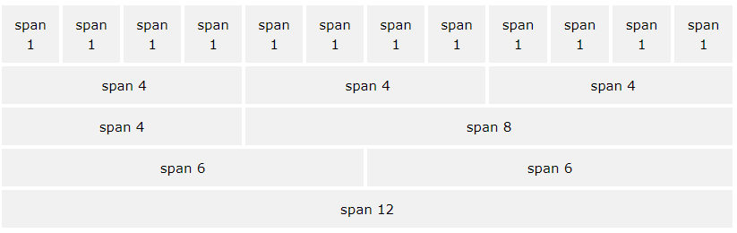
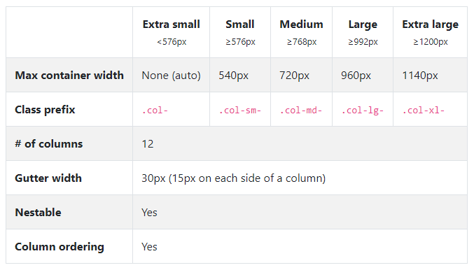
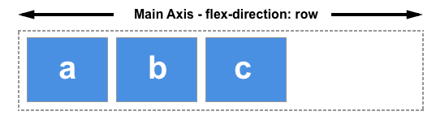
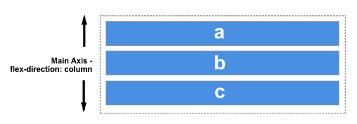
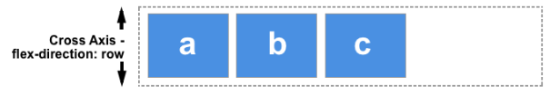
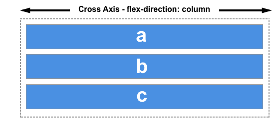

## 08 / 13 TIL | Bootstrap Grid & Flexbox

### 1. Bootstrap Grid

#### 1) 개요

 Bootstrap은 <u>반응형 12열의 Grid 시스템</u>을 제공한다. 사용자는 12열의 Grid를 1, 2, 3…11, 12개까지 묶어 사용할 수 있다.

#### 2) 구성 요소

- `container` : 웹 페이지 내에서 그리드가 중앙에 정렬될 수 있게끔 해 준다. 가로 너비에 따라 반응할 수 있게 제작하기 위해서는 `.container`혹은`.container-fluid`에서 `width:100%` 선언을 해야 한다.

  > Containers provide a means to center and horizontally pad your site’s contents. Use `.container` for a responsive pixel width or `.container-fluid` for `width: 100%` across all viewport and device sizes.

- `row` : 열(`column`)을 감싸는 기능을 한다. 모든 열은 가로로 `padding`(gutter라고 불리는)을 갖고 있고 이것을 통해 열 사이의 간격을 조절한다.

- `column` : `column` 클래스에 숫자를 표시함으로써 12열 중 얼마나 쓰고자 하는지 나타낼 수 있다. 예를 들어 동일한 너비를 갖는 3개의 열을 디자인한다면 `.col-4`를 통해 만들 수 있다. 또한 그리드 레이아웃 내에서 내용은 `column` 안에 삽입되고, `column`들은 `row`의 직계 자손으로 들어가게 된다.

- `flexbox`

- 

✍ 추가 사항 - 여러 기기에서 반응형 시스템으로 작동하기 위해 디자인할 때

대상 기기의 가로 픽셀 수 기준과 비교하여 클래스를 작성할 수 있다.

ex) 가로 픽셀이 768px 미만 : `.col-md-12/디자인하려는 열의 수(N)`

​	  가로 픽셀이 992px 이상 1200px 미만 : `.col-xl-N`

### 2. flexbox

#### 1) 개요 

flexbox Module은 아이템 간 공간 배분 및 정렬을 위한 1차원 레이아웃 모델로 설계되었다. flexbox를 1차원이라 칭하는 것은 <u>레이아웃을 다룰 때에 한 번에 하나의 차원(행 또는 열) 만을 다룬다는 의미</u>고, 이것은 행과 열을 동시에 조절하는 CSS Grid 레이아웃의 2차원 모델과 대조된다.

#### 2) 구성 요소

구성 요소를 다루기에 앞서 flexbox의 주축과 교차축이라는 두 축의 정의를 알아야 한다. **주축**은 `flex-direction` 속성을 사용하여 지정하고, **교차축**은 이 주축에 대해 수직인 축으로 결정된다. flexbox가 동작하는 것은 궁극적으로 이 축들과 직결되기 때문에 두 축의 동작 방식을 아는 것은 중요하다. 

##### ① 주축(Main axis)

> 주축은 `flex-direction`에 의해 정의되고, 4개의 값을 갖는다.

- row
- row-reverse
- column
- column-reverse

`row` 또는 `row-reverse`를 선택한 경우, 주축은 inline 방향으로 행을 따라간다.

`column` 또는 `column-reverse`를 선택한 경우 주축은 페이지의 上➡下 블록 방향을 따라간다.

② 교차축(Cross axis)

> 교차축은 주축에 수직한 축이다.

만약 `flex-direction`(주축)이 `row`나 `row-reverse`라면 교차축은 열 방향을 따라간다.

`column`이나 `column-reverse`인 경우에는 교차축이 행 방향이 된다.

#### 3) 다양한 flex 관련 명령어

- flex-wrap
- flex-flow

- align-items

- justify-content

### 3. Offset

> 열(coulmn) 그리드 사이 여백을 주는 방법은(can offset) 두 가지가 있다. `.offset-`을 쓰거나 마진 기능을 쓰는 것.

참고 문헌

https://www.w3schools.com/bootstrap/bootstrap_grid_system.asp

https://developer.mozilla.org/ko/docs/Web/CSS/CSS_Flexible_Box_Layout/Flexbox%EC%9D%98_%EA%B8%B0%EB%B3%B8_%EA%B0%9C%EB%85%90

