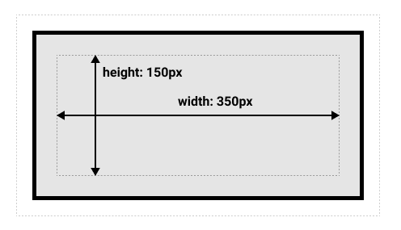

## 08 / 23 TIL


#### Q1. 왜 `justify-content`는 `items`, `self`도 없이 `content`만을 가지는가?

**Because they are NOT NECESSARY**

### CSS 적용 우선순위

1. `!important`
   - 그러나 cascading의 정상적인 작동 방식을 변경하기 때문에 CSS의 스타일에서 발생하는 문제 해결에는 어려움이 있음.
2.  inline style
3.  id 선택자
   - id는 대부분의 다른 선택자보다 우선순위가 높기 때문에 다루는 데에 어려움이 있을 수 있음.
   - **대부분의 경우 class 선택자로 작성하는 것을 권고**하며 아래와 같은 특별한 경우에는 id 선택자 사용을 추천함.
     - 문서 내의 링크 이동
     - `for` 사용
4. class 선택자
5. 요소 선택자
6. 소스 순서

### CSS 단위

#### em

- 상속의 영향을 받기 때문에 상황에 따른 값이 유동적일 수 있음.

#### rem

- 최상위 요소인 html(root em)의 절대 단위를 기준으로 삼고, 상속의 영향을 받지 않음. ➡ 대부분의 경우 가장 사용 빈도 높음.

#### px

- `pixel`을 기준으로 함.
- 픽셀의 크기는 변하지 않으므로 고정적인 값을 가짐.

#### %

- 백분율 단위로 상대적인 값을 가짐.
- 가변적인 레이아웃을 설계할 때 주로 사용


### Box Model

> 문서의 레이아웃을 계산할 때에 브라우저의 렌더링 엔진은 표준  **CSS 기본 박스 모델**에 따라 각각의 요소를 사각형 박스로 표현한다.
>
> 이 때 하나의 박스는 <u>Content, Padding, Border, Margin의 4가지 영역(Area)</u>으로 구성된다.


1.  Content : 글이나 이미지 등 요소의 실제 내용을 포함하며 배경색, 이미지 지정이 가능함.  Content 영역의 크기는 `width(너비) × height(높이)`.
2.  Padding (안쪽 여백) : 테두리 기준 안쪽 여백으로 배경색, 이미지 지정이 가능함. 
3.  Border(테두리)
4.  Margin(바깥 여백) : 테두리 기준 바깥쪽 여백으로 배경색의 지정이 불가능함. <u>여백 상쇄</u>가 발생하는 경우에는 요소 간 바깥 여백이 공유되므로 여백의 영역이 명확하게 결정되지 않음.
   - 여백 상쇄 / 마진 상쇄 : `block`의 top 또는 bottom margin이 때로는 결합되는 마진 중 가장 크기가 큰 마진으로 결합/상쇄(combine, collapsed) 되는 것.

```css
.box {
  width: 350px;
  height: 150px;
  margin: 25px;
  padding: 25px;
  border: 5px solid black;
}
```

위와 같은 CSS 값은 아래와 같은 그림을 만들어 낸다.



실제 상자가 차지할 너비 = `width` + `margin` + `padding` + `border×2` = 350 + 25 + 25 + (5 × 2) =  410 px

실제 상자가 차지할 높이 = `height` + `margin` + `padding` + `border × 2` = 150 + 25 + 25 + (5 × 2) = 210 px


### Display

> `block`과 `inline` 요소 중에서 어느 쪽으로 처리할지 하는 문제와 `flow`, `grid`, `flex`와 같은 자식 요소의 레이아웃을 결정할 때도 사용된다. - 어떻게 표시할 것인가?
>
> 형식적으로는 요소의 내부 및 외부의 디스플레이 유형을 설정한다. <u>외부 디스플레이 유형</u>은 플로우 레이아웃에 요소가 참여하는 방법을 나타내고, <u>내부 디스플레이 유형</u>은 자식의 레이아웃 방식을 설정한다.

#### Display 유형

- `block`
  - 너비는 100%
  - 요소를 block 요소처럼 표시함.
  - 자동으로 앞 뒤 줄바꿈이 발생함.
  - ex : `div`, `ul`,`hr`, `form` 등
- `inline`
  - Content 영역만큼 가로 폭을 차지함.
  - width, height, margin-top/bottom의 지정이 불가능함.
  - 상하 여백은 line-height로 지정함.
  - 줄바꿈 ❌
  - ex: `img`, `input`, `label` 등 주로 텍스트 관련된 내용
- `inline-block`
  - inline처럼 텍스트의 흐름대로 나열할 수 있으며 block처럼 박스 형태이기 때문에 해당 속성 사용 가능함.
- `none`
  - 해당 요소를 화면에서 사라지게 하며 요소의 공간도 사라지게 함(박스가 생성되지 않으므로 차지하는 공간도 없음).
  - `visibility: hidden;`은 화면에서 사라지게는 하지만 공간의 존재까지 없애지는 않음.

### Position

> 문서 상에 요소를 배치하는 방법을 지정한다.
>
> 박스의 위치 속성 및 값을 결정하는 방식.


#### Position 유형

- `static`  : 
  - 기본값. 요소를 일반적인 문서 흐름에 따라 배치함.
  -  top/bottom/right/left/z-index 속성이 아무런 영향을 주지 않음.
  - 부모 요소 내에서 배치될 때는 부모 요소 위치를 기준으로 배치됨.
- `relative`(상대 위치)
  - 요소를 일반적인 문서 흐름에 따라 배치하되, <u>자기 자신을 기준으로-**원래 있던 위치(static 위치)**-좌표 속성을 사용해</u> top/bottom/right/left 값에 따라 offset을 적용함. offset은 다른 요소에는 영향을 끼치지 않으므로 곧 요소가 차지하는 실질적인 공간은 `static`일 때와 동일함.
- `absolute`(절대 위치)
  - 요소를 일반적인 문서 흐름에서 배제하며 페이지 레이아웃에 공간 할당도 하지 않지만 가장 가까운 위치 지정 조상 요소(**static이 아닌** 부모/조상)에 대해 상대적으로 배치함. 단, <u>조상 요소 중 위치 지정 요소가 없다면 초기 container block을 기준으로(`body`)</u> 삼고, 최종 위치는 top/bottom/right/left 값이 결정하게 됨.
- `fixed`
  - 요소를 일반적인 문서 흐름에서 배제하고, 페이지 레이웃에 공간 할당도 하지 않지만 viewport의 초기 container block을 기준으로 한 위치에 배치함. 
  - 스크롤을 이동하더라도 항상 동일한(고정된) 위치에 있음(=브라우저를 기준으로 이동).
  - ex: 내비게이션 바 등


**즉, `relative`, `absolute`, `fixed`는 좌표 속성(top/bottom/right/left, 음수 값 가능)을 이용하여 이동이 가능하다.**

✔ Emmet


------

참고 자료

https://developer.mozilla.org/ko/docs/Web/CSS/CSS_Box_Model/Introduction_to_the_CSS_box_model

https://developer.mozilla.org/ko/docs/Web/CSS/display


