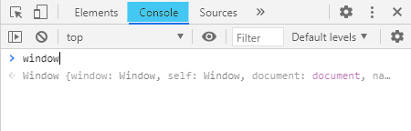

## 10 / 12 JS

### DOM(Document Object Model)

> 문서 객체 모델

Ctrk+Shift+I (검사) ➡ Console에서 JS Debugging이 가능하다.

`print()`(in python) == `console.log()`(in JS)

`remove` 다 날림 ㄹㅇ

JS에서 `const`로 지정해 준 변수는 다른 값으로 재할당이 불가능하다.

`querySelector`

