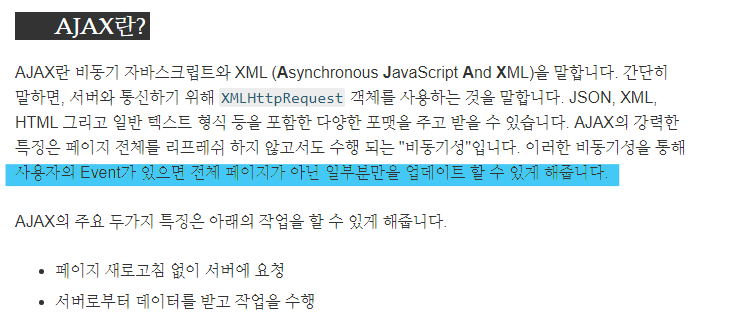
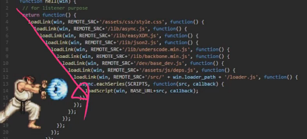
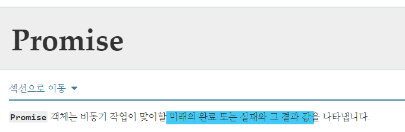
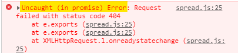
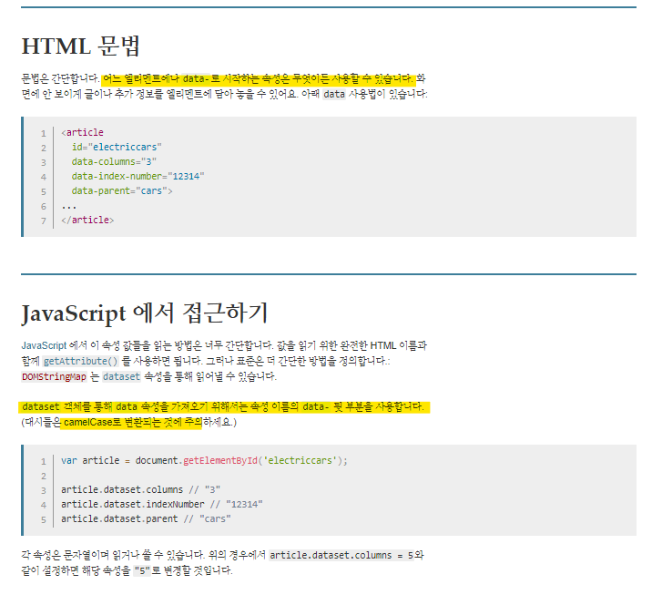

## 10 / 14 JS 심화


> ECMA Script
>
> Coding Style Guide
>
> AJAX
>
> Callback Function
>
> Promise

### ECMA Script

#### 변수

- var
- let
- const

#### 타입과 연산자

- null : 개발자의 공백 의도
- undefined

#### 조건 & 반복

#### 함수

- 선언
- 표현

#### 자료 구조

- Array 

  - ArrayHelperMethod : map, reduce, every, filter

- Object

  - JSON
  - Object 축약 문법

  

### ASI(Automatic Semicolon Insertion)

= `;` : 문장의 마침표.

찍어야 한다 vs 안 찍어도 된다 논쟁 ing~

### Coding Style Guide

> JavaScript Standard Style 

- Indent = 2 spaces
- `==` 대신 `===`  / `!=` 대신 `!==`사용

<hr>

### AJAX

아약스라고 읽었는데.....ㅎㅎ;

> **A**synchronous **J**avaScript **A**nd **X**ML ( 비동기 자바스크립트와 XML)



✅ 전체의 reload가 아니라 <u>일부</u>만을 변화시키는 것

> XHR : XML Http Request
>
> 전체 페이지의 새로고침 없이도 URL로부터 데이터를 받아올 수 있게 함

#### Asynchronous | 비동기

>  How JavaScript Works?

##### Asynchronous

*기다려 주지 않음*

"why?"

⬇

##### Single Thread

*한 번에 하나의 일만 **혼자 일하기 때문***

⬆ *Event  Loop*에 기반하여서

##### Event Loop

- Call Stack : 요청이 들어올 때마다 해당 요청을 순차적으로 처리하는 Stack(LIFO) 형태의 자료 구조
- Web API(Browser API): JavaScript 엔진이 아닌 브라우저 영역에서 제공하는 API
- Task Queue : CallBack 함수가 대기하는 Queue(FIFO) 형태의 자료 구조
- Event Loop : Call Stack에 현재 실행 중인 Task가 없는지 확인 ➡ Task Queue에 Task가 있는지 확인

<hr>

### Callback Function

#### Callback

인자로 넘어가는 함수. 내가 직접 요청한 것이 아니라 <u>시스템 내</u>에서 호출됨으로써 기능하는 함수!

### Promise

> Let's think about…
>
> 해야 할 일이 많은 상태에서 교수님께 질문을 했다! ➡ 답변을 받기 전까지 다른 일을 진행 ❌(계속 대기 중) : 동기(Sync)
>
> 해야 할 일이 많은 상태에서 교수님께 질문을 했다! ➡ 답변을 기다리는 동시에 이것저것 할 일을 한다 ➡ 답변이 도착하면 그 때 관련 일을 한다 : 비동기(Async)
>
> ∴ <u>~~면 --한다!</u>(연쇄적)



하지만 '연쇄적'에 매여서 코딩하게 되면 이런 **CallBack Hell**에 빠질 수 있으므로 주의

그래서 Promise ㄷㄷㄷㅈ ❗❕



- `.then`: 완료한 경우(성공)

- `.catch` : 실패한 경우

#### async & await

from ES8+

> Syntactic Sugar
>
> 문법적으로 쉬운 사용을 위해 🤩

await은 async 내부에서만 사용이 가능하며

async은 비동기로직을 포함한 경우에만 사용이 가능

#### 🌟 axios 🌟

> Promise based HTTP client for the browser and node.js
>
> Promise 기반의 비동기 객체

``` html
// example code

axios.get('jsonplacehoder URL 어쩌구')
// "To.axios.. 저 url로 get 요청 보내줘!"
  .then(function(res){
    console.log(res.data.title)
})
  .catch(function(error){
    console.log(error)
})
```

Bootstrap ⬅ CDN

axios ⬅ 

[axios 공식 Github-installing]: https://github.com/axios/axios

Chaining

##### Source Code 1

``` html
axios.get('https://jsonplaceholder.typicode.com/todos/asdf')
      .then(function (res) {
        console.log(res)
        return res.data
      })
      .then(function (res) {
        console.log(res)
        return res.title
      })
      .then(function (res) {
        console.log(res)
      })
      // .catch(function (err) {
      //   console.log(err)
      // })
```



에러를 잡지 못한 상황 ➡  `.catch` 필요함

<hr>

##### index.html

``` html



  <h1 class="text-center">Articles</h1>
  <a href="">NEW</a>
  <hr>
  
    <p><b>작성자 : <a href="">{{ article.user }}</a></b></p>
    <p>글 번호: {{ article.pk }}</p>
    <p>글 제목: {{ article.title }}</p>
    <p>글 내용: {{ article.content }}</p>
    <form class="d-inline like-form" data-article-id="{{ article.pk }}">
      
      
        <button class="btn btn-link">
          <i id="like-{{ article.pk }}" class="fas fa-heart fa-lg" style="color:crimson;"></i>
        </button>
      
        <button class="btn btn-link">
          <i id="like-{{ article.pk }}" class="fas fa-heart fa-lg" style="color:black;"></i>
        </button>
      
    </form>
    <p>
      <span id="like-count-{{ article.pk }}">
        {{ article.like_users.all|length }} 명이 이 글을 좋아합니다.
      </span>
    </p>
    <a href="">[detail]</a>
    <hr>
  
  <script src="https://cdn.jsdelivr.net/npm/axios/dist/axios.min.js"></script>
  <script>
    const forms = document.querySelectorAll('.like-form')
    forms.forEach(function (form) {
      form.addEventListener('submit', function (event) {
        event.preventDefault()
        // console.log(event)
        const articleId = event.target.dataset.articleId
        const csrftoken = document.querySelector('[name=csrfmiddlewaretoken]').value
        
  axios.post(`http://127.0.0.1:8000/articles/${articleId}/like/`, {}, {
          headers: {
            'X-CSRFToken': csrftoken
          }}
        )
        .then(function (res) {
          // console.log(res)
          const count = res.data.count
          const liked = res.data.liked
          // console.log(count, liked)

          const likeIconColor = document.querySelector(`#like-${articleId}`)
          // console.log(likeIconColor)
          const likeCount = document.querySelector(`#like-count-${articleId}`)
          // console.log(likeCount)

          likeCount.innerText = `${count} 명이 이 글을 좋아합니다.`

          if (liked) {
            likeIconColor.style.color = 'crimson'
          } else {
            likeIconColor.style.color = 'black'
          }

        })
      })
    })
  </script>


```

##### views.py

``` python
@require_POST
def like(request, article_pk):
    if request.user.is_authenticated:
        article = get_object_or_404(Article, pk=article_pk)
        user = request.user

        if article.like_users.filter(pk=user.pk).exists():
        # if user in article.like_users.all():
            article.like_users.remove(user)
            liked = False
        else:
            article.like_users.add(user)
            liked = True

        like_status = {
            'liked': liked,
            'count': article.like_users.count(),
        }
        return JsonResponse(like_status)
        # return redirect('articles:index')
    return redirect('accounts:login')

```


① `<form class="d-inline like-form" data-article-id="{{ article.pk }}">` : form에 like-form이라는 이름으로 class를 주었다.

② `const forms = document.querySelectorAll('.like-form')` : like-form 이라는 클래스를 갖는 모든 form을 갖고 오겠다

③ 

``` javascript
forms.forEach(function (form) {
    // 이 form은 submit 이벤트가 발생하면 ~~를 실행한다! 
      form.addEventListener('submit', function (event) {
          // preventDefault()를 통해 기본으로 설정된 이벤트를 X
        event.preventDefault()
        // console.log(event)
        const articleId = event.target.dataset.articleId
        const csrftoken = document.querySelector('[name=csrfmiddlewaretoken]').value
```

##### ✅ data attribute html



④ ``<form class="d-inline like-form" data-article-id="{{ article.pk }}">`에서 `data-article-id` 부분이 위의 Data Attribute HTML에 해당하는 내용이다. `article-id` 부분은 CamelCase로 적용돼서 변환됨(➡ articleId)

⑤ 변수는  ``(backtick)`과 `$` 를 이용해서 표현한다. 

``` javascript
// example

axios.post(`http://127.0.0.1:8000/articles/${articleId}/like/`)
```

⑥ Status Code 403 = 권한과 관련 ➡ CSRFToken

axios를 통해 POST 요청을 넘기기 때문에 CSRF Token 재설정이 필요함.

> [Django AJAX Request Docs.]: https://docs.djangoproject.com/en/3.1/ref/csrf/
>
> : header 안에 CSRF Token을 넣어서 요청과 함께 보내주어야 한다.

위치로 header정보임을 파악하기 때문에 중간에 `{}` 라는 빈 object를 넣음으로써 3번째임을 인식할 수 있도록 위치를 지정한다.

``` javascript
 axios.post(`http://127.0.0.1:8000/articles/${articleId}/like/`, {}, {
          headers: {
            'X-CSRFToken': csrftoken
          }}
        )
```

⑦ views.py에서 설정 - 좋아요를 눌렀을 경우

Boolean을 사용한다.

``` python
if article.like_users.filter(pk=user.pk).exists():
        # if user in article.like_users.all():
            article.like_users.remove(user)
            liked = False
        else:
            article.like_users.add(user)
            liked = True
        like_status = {
            'liked': liked,
            'count': 
            # article에 좋아요한 like_users의 수를 count() 한다.
            article.like_users.count(),
        }
```

⑧ promise 객체가 <u>성공한 경우</u>를 받아와야 하므로 `.then`을 사용한다.

``` javascript
.then(function (res) {
          // console.log(res)
          const count = res.data.count
          const liked = res.data.liked
          // console.log(count, liked)
```

⑨ `{{ article.pk }}`만 id로 적으면 결과적으로 숫자만 갖고 오는 셈이 되는데 숫자만 받아올 수 는 없으므로 앞에 `like-`를 덧붙인 것!

``` javascript
<i id="like-{{ article.pk }}" class="fas fa-heart fa-lg" style="color:black;"></i>
```


