## 10 / 16 JavaScript Summary

#### 1. 변수

- `let` : 값을 재할당할 수 있는 변수를 선언함.

  - <u>한 번만 선언 가능</u>하며, <u>재할당은 여러 번 가능</u>하다.

  - ``` java
    let x = 1
    let x = 3
    ```

  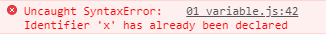

  ​			x가 이미 할당되어 있으므로 에러 발생.

  - Block Scope - Block을 설정하면 유효 범위를 갖게 된다

  - ``` javascript
    let x = 1
    
    if (x === 1) {
      let x = 2
      console.log(x)  // 2
    }
    
    console.log(x)    // 1
    ```

    `{}` 안에서 설정된 값은 그 범위 내에서만 기능한다.

    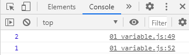

- `const` : 값이 변하지 않는 상수를 설정하는 키워드

  **상수 ↔ 변수에 대응하는 의미**

  수학에서 쓰는 상수(Constant)의 의미가 아님..ㄹㅇ 숫자만 써야 한다는 뜻 ❌

  - 선언 시 반드시 초기값을 설정해 주어야 한다

    ``` javascript
    // const myFav = 'Faker'
    const myFav 
    ```

    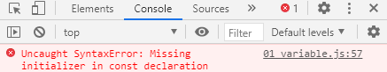

  - `const`의 값은 재할당 및 재선언이 불가능하다

    - 재할당의 경우

    ``` javascript
    const myFav = 1916
    myFav = 123 
    ```

    

    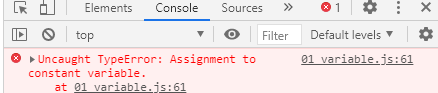

    - 재선언의 경우

    ``` javascript
    const myFav = 'movies'
    const myFav = 'movies'  let myFav = 'movies'    // Uncaught SyntaxError: Identifier 'myFav' has already been declared
    var myFav = 'movies'let myFav = 'movies'    // Uncaught SyntaxError: Identifier 'myFav' has already been declared
    let myFav = 'movies' let myFav = 'movies'    // Uncaught SyntaxError: Identifier 'myFav' has already been ed
    
    ```

    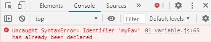

  - Block Scope를 갖고 있다.

    ``` javascript
    const myFav = 7
    
    if (myFav === 7) {
      const myFav = 20
      console.log(myFav)
    }
    
    console.lomyFav) 
    ```

    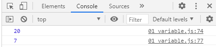

- `var` : ES6 이전에 사용됐던 변수 선언 키워드

  - var 키워드로 선언한 변수는 같은 var 키워드로 재선언이 가능하다.

    ``` javascript
    var num = 34
    var num = 75
    console.log(num)
    ```

    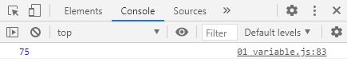

    변수 num에 할당된 값이 바뀐 것을 확인 가능하다!

    `var` 키워드는 많은 문제 발생의 단점이 있으므로 **절대 사용하지 않는다**

◈ `hoisting`

`var`의 경우

``` javascript
console.log(name)  // undefined => 선언 이전에 참조

var name = '홍길동'  
```

뒤늦게 선언되더라도 해당 선언을 끌어올려서(hoist해서) 값 출력에 에러가 발생하지 않는다.

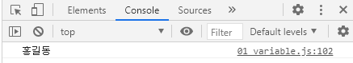

`let`의 경우

``` javascript
console.log(name)

let name = '홍길동'
```

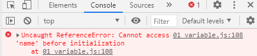

`const`의 경우

``` javascript
console.log(name)
const name = '홍길동'
// 얘는 당연하다. const의 경우 초기값 설정이 필수적이므로~
```

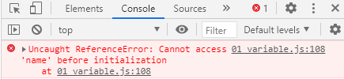


`var`로만 해서 hoisting이 잘 되면...`var` 사용은 권장하지 않는 방식이라고 했을 때...hoisting도 그다지 권장되는 방식은 아닌 건가?😐😐😐


#### 2. 타입과 연산자 | Type & Operator

##### 타입

- 숫자 (Number)
- Boolean
- EmptyValue
  - <u>값이 존재하지 않음을 표현</u>하는 값으로 `null`, `undefined`가 있음. 두 값에 큰 차이를 두지 않고 유동적으로 사용하는 것을 권장.
  - `undefined`는 값이 존재하지 않을 경우 JavaScript 내에서 할당하는 값, `null`은 값이 없다는 것을 표현하기 위해 개발자가 인위적으로 사용하는 값으로 이해 ⭕ 

null type = object

할당 연산자

- `++`
- `--`

동등 연산자

- 형변환 발생

일치 연산자

두 연산자 차이

`switch` - break

`for`

기본 `for`에서는 const 쓰면 에러가 남(const는 불변하는 값에 사용 -> `let` 사용)

`for of`

const 사용

`for in`


### 함수

기명함수 표현식 X

- 표현식
- 선언식


### 자료 구조

배열 - 음수 인덱스 없음

`push` & `pop`

`join` python의 경우와 차이 있음

선언 -> python과 달리 key 값에 따옴표 안 해 줘도 됨

ex. 공백, `-` 포함, 숫자 시작 등의 경우에는 따옴표로 해서 알려줘야 함.

요소 접근

python의 경우 : `get`사용 ->`me.get('name')`

JS의 경우 : 그냥 쓰면 됨 -> `me.name`

축약 문법

``` html
<script>
  const student ={
      name : 'name'  // 축약 불가(문자열일 때는 X)
      name : name    // 축약 가능
  }
</script>
```


### ArrayHelperMethod

- reduce

  한 번 보고 영 아니다 싶으면 skip

- forEach : 사용할 줄 알아야 하고 어떤 일이 실행되는지도 알아야 함

- map  : 하나하나 실행한 결과를 배열로 만들어서 return해 줌.

- filter

>  "forEach, filter 사용 빈도 높을 것 같다"
>
> -빈산쌤

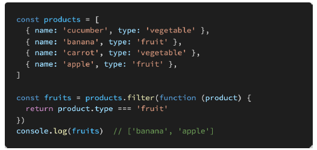

마지막 줄 코드 Error

``` html
fruits[0].name
fruits[1].name 
이런 식으로 찍어야 name 값이 출력됨
```

- find
- some


<hr>

좋아요 / 팔로우 django를 통해 구현한 것도 참고하면 좋음