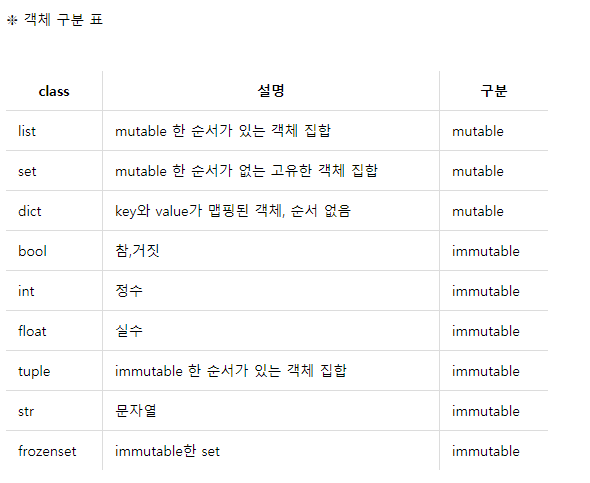

## 08 / 10


✅ TIL이라기엔 예전에 배운 거 복습하는 데 의미가 더 있다. 

✔ 그래서 제목에 TIL을 적지 않은 것.


### 1. Container

> 컨테이너란 여러 개의 값을 저장할 수 있는 구조를 말한다(객체 ❌).
>
> 시퀀스(sequence)형, 비시퀀스(non-sequence)형 2가지로 분류된다.

시퀀스(Sequence) : 데이터가 순서대로 나열된(ordered) 형식을 의미한다.

**순서대로 나열되었다(ordered) ≠ 정렬되었다(sorted)**

#### 1) 시퀀스(Sequence)형 컨테이너

- 특징
  - 순서를 갖는다.
  - 특정 위치의 데이터를 가리킬 수 있다(=index 활용이 가능하다)
- 종류
  - 리스트(list)
  - 튜플(tuple)
  - 레인지(range)
  - 문자형(string)
  - 바이너리(binary)

##### (1) 리스트(list)

: [value1, value2, value3 ..]

- 리스트는 `대괄호[]` 및 `list()`를 통해 만들 수 있다.
- 값에 대한 접근은 `list[i]` 를 통해 할 수 있다.

##### (2) 튜플(tuple)

: (value1, value2, value3 ...)

- `()`로 묶어서 표현한다.
- 수정 불가능(불변, immutable)하며 읽기 전용만 가능하다.

##### (3) 레인지()

`range`는 숫자의 시퀀스를 나타내는 데에 사용된다.

- 기본형  `range(n)` 

  : 0 ~ (n-1) 까지의 값을 갖는다.

- 범위 지정 `range(n, m)`

  : n ~ (m-1) 까지의 값을 갖는다.

- 범위 및 스텝 지정 `range(n, m ,s)`

  :  n~ (m-1) 까지 +s만큼 증가한다(음수로 적으면 감소).


#### 2) 비시퀀스(non-sequence)형 컨테이너

- 종류
  - 셋(set)
  - 딕셔너리(dictionary)

##### (1)셋( set)

`set`은 순서가 없는 자료구조이다.

{value1, value2, value3 ...}

- `set`은 수학에서의 집합과 동일하게 처리된다.
- `set`은 `{}` 를 통해 만들며, 순서가 없고 중복된 값이 없다
- 빈 집합은`set()`을 통해 만들 수 있다 (`{}` 사용 ❌)


##### (2) 딕셔너리(dictionary)

`key`와 `value`가 쌍(pair)으로 이루어져 있는 자료구조이다.

{key1 : value1, key2 : value2, key3 : value3 ...}

- `{}`, `dict()` 로 빈 딕셔너리를 만들 수 있다.
- `key`는 변경 불가능(immutable)한 데이터만 가능하다
- `value`는 `list`, `dictionary`를 포함한 모든 것이 가능하다.


### 2. 데이터의 분류

> 데이터는 크게 변경 가능한 것(mutable), 변경 불가능한 것(immutable)로 나뉜다.


#### 1) 변경 불가능한(immutable)

- 단일 데이터들
  - 숫자(Number)
  - 글자(String)
  - 참/거짓(Bool)

- range()
- tuple()
- frozenset()

#### 2) 변경 가능한(mutable)

- container - `tuple()`,`range()`, `frozenset`
- list
- dict
- set
- 사용자가 만든 데이터 타입



​																	*출처 : https://wikidocs.net/16038*

### 3. 데이터 구조 

> 데이터 구조란, 데이터에 대한 접근 및 변경을 편리하게 하기 위해 데이터를 저장하거나 조작하는 방법을 의미한다.


#### 1) 문자열(String)

> 변경할 수 없고 - immutable
>
> 순서가 있고 - ordered
>
> 순회 가능한 - iterable

#### 2) 리스트(List)

> 변경 가능하고 - mutable
>
> 순서가 있고 - ordered
>
> 순회 가능한 - iterable

#### 3) 셋(Set)

> 변경 가능하고 - mutable
>
> 순서가 없고 - unordered
>
> 순회 가능한 - iterable

#### 4) 딕셔너리(Dictionary)

> 변경 가능하고 - mutable
>
> 순서가 없고 - unordered
>
> 순회 가능한 - iterable

##### -  반복문을 활용한 딕셔너리 순회

딕셔너리의 `key`에 접근할 수 있으면 `value`에도 접근 가능하다.

- 딕셔너리에서 `for`를 활용하는 4가지 방법

  ```python
  #1. dictionary 순회(key 활용)
  for key in dict :
      print(key)
      print(dict[key])
      
  #2. keys() 활용
  for key in dict.keys() :
      print(key)
      print(dict[key])
      
  #3. values() 활용
  for val in dict.values():
      print(val)
     
  #4. .items() 활용
  for ket, val in dict.items() :
      print(key, val)
  ```

  

#### 5) 데이터 구조에 적용 가능한 Built in Function

> 순회 가능한(iterable)데이터 구조에 적용 가능하다.

- map(function, iterable)

  : 순회 가능한 데이터 구조의 모든 요소에 function을 적용한 후 그 결과를 돌려 주며 return은 `map_object` 형태이다.

- filter(function, iterable)

  : iterable에서 function의 반환된 결과가 `True`인 것들만 구성하여 반환하며, `filter object`의 형태로 반환한다.

- zip(*iterables)

  복수의 iterable 객체를 모아 주며,  튜플의 모음으로 구성된 `zip object`를 반환한다.

### 4. 메소드

> 특정 객체별로 사용할 수 있는 함수가 정해져 있고 이 때 이 함수를 메소드라고 부른다.

활용법 : 객체.조작법()

#### 1) 문자열 메소드

- 변형

  - `.capitalize()` : 앞글자를 대문자로 만들어서 반환함.
  - `.title()` : 어포스트로피나 공백 이후를 대문자로 만들어서 반환함.
  - `.upper()` : 모두 대문자로 만들어서 반환함.

  - `.lower()` : 모두 소문자로 만들어서 반환함.
  - `.swapcase()` : 대↔소문자 서로 변경하여 반환함.
  - `.join(ITERABLE)` : 특정한 문자열로 만들어서 반환함.
  - `.replace(OLD, NEW[, count])` : 바꾸고자 하는 글자를 새로운 글자로 바꾸어서 반환하며, count를 지정하면 해당 개수만큼만 시행함.
  - `strip([chars])` : 글씨 제거. 특정한 문자들을 지정했을 때 양쪽, 왼쪽(`lstrip`,) 오른쪽(`rstrip`) 중 하나를 제거. 지정하지 않은 경우는 <u>공백</u>을 제거함.
  - `'separator'.join(iterable)` : 특정한 문자열로 만들어 반환함. iterable한 컨테이너의 요소들을 separator를 구분자로 합쳐 `join()` 문자열로 반환하는 구조임.

- 탐색 / 검증
  - `.find(X)` : X의 첫 번째 위치를 반환. 없을 때는 `-1`을 반환함. 
  - `.index(X)` : X의 첫 번쨰 위치를 반환. 없을 때는 `오류`가 발생함.
  - `.split()` : 문자열을 특정한 단위로 나누어서 리스트로 반환함.


#### 2) 리스트 메소드

- 값 추가 및 삭제

  - `.append(X)` : 리스트에 값을 추가함.
  - `.extend(ITERABLE)` : 리스트에 iterable한 값(list, range, tuple, string 유의)을 붙일 수 있음.
  - `.insert(i,X)` : 정해진 위치 i에 X라는 값을 추가함.
  - `.remove(X)` : 리스트에서 값이 X인 것을 삭제함.
  - `.pop(i)` : 정해진 위치 i에 있는 값을 삭제하며, 그 항목을 반환함. i가 지정되지 않은 경우에는 마지막 항목을 삭제하고 되돌려 줌.

- 탐색 / 정렬

  - `.index(X)` : 원하는 값을 찾아 index 값을 반환함.
  - `.count(X)` : 원하는 값의 개수를 확인함.
  - `.sort` : 정렬. `sorted()`와는 다르게 원본 리스트에 변형이 생기며 `None`을 리턴함.  <u>`sorted()`와는 다르다 `sorted()` 와는...!!</u>
  - `reverse()` : 반대로 뒤집는다. 정렬 ❌

- 복사

  - `얕은 복사(shallow copy)` : slice 연산자`[:]`나 `list()` 를 활용하는 경우 내부 객체에는 복사가 적용되지 않는다. 또한 mutable, immutable한 자료형 각각의 경우에 다르게 동작한다.

  - `깊은 복사(deep copy)` : 중첩된 상황에서 복사를 하고자 할 때, 내부에 있는 객체에도 copy가 적용된다.

    ```python
    import copy
    
    a = [1,2[1,2]]			# a는 2차원 배열
    b = copy.deepcopy(a)	# copy.deecopy 메소드 사용
    
    b[2][0] = 3
    print(a)
    ```

- `.clear()` : 삭제. 리스트의 모든 항목을 삭제한다.


#### 3) 딕셔너리 메소드

- 추가 및 삭제
  - `.pop(key[,default])` : key가 딕셔너리에 있으면 제거하고 그 값을 돌려 줌. 그렇지 않으면 default를 반환함. default가 없는 상태에서 key가 딕셔너리에 없으면 `KeyError`가 발생하게 됨.
  - `.update()` : 값을 제공하는 `key`, `value`로 덮어씀.
  - `.get(key[, default])` : key를 통해 value를 가져옴. 이 때는 절대로 `KeyError`가 발생하지 않는다. 또한 default는 기본적으로 None 값을 가짐.

#### 4) 세트 메소드

- 추가 및 삭제
  - `.add(elem)` : elem을 세트에 추가한다.
  - `.update(*others)` : 여러 값을 추가하며, 인자로는 반드시 iterable한 데이터 구조를 전달해야 한다.
  - `.remove(elem)` : elem을 세트에서 삭제하고, 없으면 KeyError가 발생한다.
  - `.discard(elem)` : elem을 세트에서 삭제하고 없어도 에러가 발생하지 않는다.
  - `.pop()` : 임의의 원소를 제거해 반환한다.


### 5. 함수 / Function

> 특정한 기능을 하는 코드의 묶음

#### 1) 함수의 선언과 호출

- 함수 선언은 `def`로 하여 `:`로 끝나며 동작 후에 `return`을 통해 결과값을 전달할 수도 있다(`return` 값이 없을 때는 `None`을 반환한다).
- `return` 값은 오직 한 개의 객체만 반환되며, `return`되거나 종료될 시에는 함수를 호출한 곳으로 돌아간다.
- 함수의 호출은 `func()` , `func(val1, val2)` 와 같은 방법으로 한다.

```python
def 함수이름(parameter1, parameter2) :
    코드 블럭
    return value
```

#### 2) 함수의 입력  / Input

> 매개변수(Parameter), 인자(Argument)

##### (1) 매개변수

```python
def func(x) :			# x는 매개변수
    return x + 2
```

: 입력을 받아 <u>함수 내부에서 활용할 변수</u>라고 생각하면 되며 함수의 정의 부분에서 볼 수 있다


##### (2) (전달)인자(Argument)

```python
func(2)					# 2는 (전달)인자
```

: <u>실제로 전달되는 입력값</u>이라고 생각하면 되며, 함수를 호출하는 부분에서 볼 수 있다.

- 위치 인자 / Positional Arguments

  함수는 기본적으로 인자를 위치로 판단한다.

- 기본 인자 값 / Default Argument Values

  함수가 호출될 때 인자를 지정하지 않아도 기본 값을 설정할 수 있다.

- 키워드 인자(Keyword Arguments)

  직접 변수의 이름으로 특정 인자를 전달할 수 있다.

- 가변(임의) 키워드 인자(Arbitrary Keyword Arguments)

  정해지지 않은 키워드 인자들은 `dict` 형태로 처리되고 `**`로 표현한다. 일반적으로 `kwargs`라는 이름을 사용하며 `**kwargs`를 통해 인자를 받고 처리할 수 있다. 

  ```python
  def func(**kwargs):		
      # 임의 개수의 키워드 인자를 받는 것을 의미
  ```

  

- 가변(임의) 인자 리스트(Arbitrary Argumetns Lists)

  개수가 정해지지 않은 임의의 인자를 받기 위해서 가변 인자 리스트 `*args`를 사용하며 이 때 리스트는 `tuple`의 형태로 처리되고, 매개변수에 `*`로 표현한다.

  ```python
  def func(a, b, *args) :
      
      # *args : 임의 개수의 위치인자를 받는 것을 의미.
      # 보통 이 가변 인자 리스트는 매개변수 목록의 마지막에 위치함
  ```


#### 3) 함수와 스코프(Scope)

> 함수는 코드 내부에 스코프라는 공간을 생성하며, 이 때 생성된 공간은 함수 외부 공간과 구분된다.

- 스코프

  - 전역 스코프(global scope) : 코드 어디에서든 참조가 가능한 공간 - 전역 변수(global varible)
  - 지역 스코프(local scope): 함수 생성으로 만들어진 스코프로 함수 내부에서만 참조가 가능한 공간 - 지역 변수(local variable)

  ```python
  # 전역 스코프
  a = 30 # 전역 변수
  
  def func(z) :
      #지역 스코프
      c = 75
      a = 10
      print(y)
      
  #변수 c는 접근이 불가능함
  ```


 - 이름 검색 규칙

   Python에서 사용되는 이름(식별자)들은 이름공간에 저장돼 있으며 이것을 `LEGB Rule`이라고 부르고, 아래와 같은 순서로 이름을 찾는다.

   Local Scope				: 정의된 함수 / 함수 호출될 때 생성, 종료될 때까지 유지(함수 내에서 처리 불가한 예외 일으킬 시 삭제됨)

   ⬇

   Enclosed Scope		: 상위 함수 

   ⬇

   Global Scope				: 함수 밖의 변수 혹은 import된 모듈 / 모듈이 호출된 시점 이후 or 이름 선언된 이후부터 인터프리터가 끝날 때까지 유지

   ⬇

   Built-in Scope			: Python 내장 함수 혹은 속성 / Python 실행된 이후부터 영원히 유지


#### 4) 재귀함수 / Recursive Function

> 함수 내부에서 자기 자신을 호출하는 함수. 재귀 함수를 작성할 때는 반드시 <u>base case</u>가 존재하여야 한다.


### 6. 객체지향 프로그래밍 / OOP

#### 1) 객체

> Python에서 모든 것은 객체(Object)이며, 모든 객체는 타입(type), 속성(attribute), 조작법(method)을 가진다.

- 타입 / type : 어떤 연산자와 조작이 가능한지
- 속성 / attribute : 어떤 상태(데이터)를 가지는지
- 조작법 / method : 어떤 행위(함수)를 할 수 있는지

#### 2) 타입과 인스턴스 / Type & Instance

- 타입: 공통된 속성과 조작법을 가진 객체들의 분류

- 인스턴스: 특정 타입에서의 실제 데이터 예시

  👉 Python에서 모든 것은 객체이고, 모든 객체는 특정 타입의 인스턴스이다.

  ```python
  x = int(50)
  y = int(120)
  z = str("잠이 온다")
  
  # x, y, z는 객체
  # x, y는 int 타입, z는 str 타입의 인스턴스
  ```


#### 3) 클래스와 객체 / class & object


##### (1) 클래스(class) 생성

- 클래스 생성은 `class` 키워드와 class 이름으로 가능하다.

- 클래스 내부에는 데이터와 함수를 정의할 수 있고, <u>이 때 정의된 함수는 method</u>로 불린다.

  ```python
  class ClassName:
      methods
  ```

##### (2) 인스턴스(instance) 생성

- 정의된 클래스에 속하는 객체를 해당 클래스의 인스턴스라고 한다.
- `type()` 함수를 통해 생성된 객체의 클래스를 확인할 수 있다.
- 특정 클래스의 인스턴스는 해당 클래스()를 호출함으로써 생성된다.

#### 4) 인스턴스 & 클래스 변수

##### (1) 인스턴스 변수

- 인스턴스의 속성

- 각 인스턴스의 고유한 변수

- method 정의에서 `self.변수명`으로 정의되며, 인스턴스 생성 이후에는 `인스턴스.변수명`으로 접근 및 할당한다.

  ```python
  class Person :
      def __init__(self.name):	
          # 인스턴스 method(생성자)
          self.name = name
          # 인스턴스 변수
  ```

  

##### (2) 클래스 변수

- 클래스의 속성

- 해당 클래스의 모든 인스턴스가 공유

- 클래스 정의 내부에서 선언된다.

- `클래스.변수명` 또는 `인스턴스.변수명`으로 접근 및 할당한다.

  ```python
  class Person:
      species = human
      
      def __init__(self.name):
          self.name = name
  ```

  

